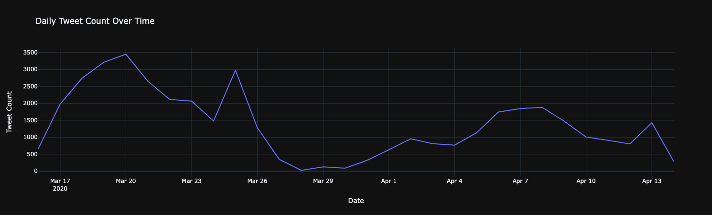
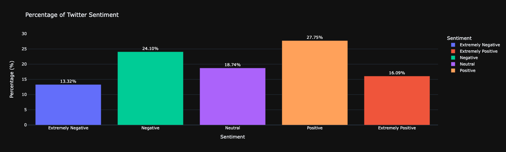
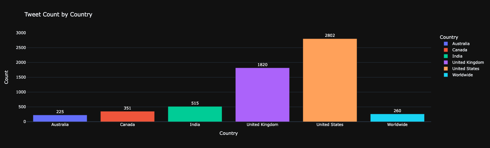
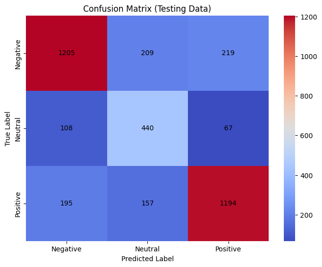

# Introduction
During the COVID-19 pandemic, Twitter became a key platform for people to express their emotions and opinions. Analyzing the sentiments of these tweets—whether positive 😊, negative 😠, or neutral 😐—provides valuable insights into public sentiment during this challenging time. This project aims to develop a machine learning model to predict the sentiment of COVID-19-related tweets.

Using a labeled dataset from Kaggle, we will first perform exploratory data analysis (EDA) 🔍 to understand the data's characteristics. Then, we will build and evaluate different models to accurately classify tweet sentiments. This analysis will help us better understand public reactions and contribute to the study of communication during global crises.

# Background
The COVID-19 pandemic, which began in early 2020, dramatically impacted daily life worldwide. During this time, people flocked to social media platforms like Twitter to express their thoughts, concerns, and experiences. Twitter, with its vast reach and real-time updates, became a key source for gauging public sentiment during the crisis.

Sentiment analysis, a key area of Natural Language Processing (NLP) 🧠, helps identify the emotional tone of text. In this project, we aim to build a machine learning model 🤖 to classify the sentiment of COVID-19-related tweets as positive, negative, or neutral. Using a labeled dataset from Kaggle 📊, we seek to understand public perception during the pandemic's critical early stages, providing insights into social reactions and emotional responses to global events.

# Exploratory Data Analysis
To begin with, the daily tweet count was examined, revealing a peak on March 20th with nearly 3,500 tweets. This surge coincides with California issuing a stay-at-home order, making it the first state in the United States to implement such a measure.


_Time Seires line grpah visualizing daily tweet count over time_

The analysis of sentiment percentages was conducted to understand social media trends during that period. The bar graph below shows that people generally leaned towards positivity, with 27.75% of tweets expressing a positive sentiment and 16.09% classified as extremely positive.


_Bar graph visualizing percentage of Tweet Sentiment_

The tweet counts for each country were analyzed to assess the level of social expression across different regions. The dataset recorded this information under the "location" field, and only locations with more than 100 tweets were considered. The results clearly show that the United States had the highest number of tweets compared to other countries.


_Bar grpah visualizing the count of tweet in each country_

# Data Preprocessing
The first step in preprocessing involves cleaning the text data. The following processes are required:
- Removing HTML tags
- Removing URLs
- Removing punctuation
- Removing stop words
- Removing non-English words
- Removing emojis
- Applying word stemming
  
The data was processed using the TF-IDF equation to convert text into columns, making it ready for model training.

```python
tfidf = TfidfVectorizer(smooth_idf=True)

X_train_tfidf = tfidf.fit_transform(X_train)
X_valid_tfidf = tfidf.transform(X_valid)
X_test_tfidf = tfidf.transform(X_test)
```
_Python code of utilizing TF-IDF_

Given the dataset's imbalance, with neutral sentiment being the least represented, oversampling is applied to increase the number of neutral tweets to match the counts of negative and positive tweets. This is achieved using SMOTE (Synthetic Minority Over-sampling Technique) to create synthetic data points for the minority class.
```python
smt = SMOTE()
X_train_sm, y_train_sm = smt.fit_resample(X_train_tfidf, y_train)
```
_Python code of utilizing SMOTE_

# Model Selection and Tuning
The following models were chosen for this project:
- Logistic Regression
- Multinomial Naive Bayes
- Random Forest Classifier
- XGBoost Classifier

Each model was trained and evaluated using various parameters to identify the optimal configuration based on the test data.

```python
models = {
    'LogisticRegression': LogisticRegression(),
    'MultinomialNB': MultinomialNB(),
    'RandomForest': RandomForestClassifier(random_state=42),
    'XGBoost': XGBClassifier(random_state=42)
}

param_grids = {
    'LogisticRegression': {},
    'MultinomialNB': {
        'alpha': [0.1, 0.5, 1.0, 1.5, 2.0]
    },
    'RandomForest': {
        'n_estimators': [100, 200, 500],
        'max_depth': [None, 10, 30],
        'min_samples_split': [2, 5, 10],
    },
    'XGBoost': {
        'n_estimators': [100, 200, 500],
        'learning_rate': [0.01, 0.1, 0.3],
        'max_depth': [3, 6, 10]
    }   
}

cv = KFold(n_splits=3, shuffle=True, random_state=42)
```
_Python code of model selection and tuning_

# Model Training
All models were trained using the GridSearchCV library, which evaluates them based on their accuracy scores. The best-performing model was XGBoost, achieving an accuracy score of 80.65%%.
```Python
grids = {}
for model_name, model in models.items():
    print(f'Training and tuning {model_name}...')
    grids[model_name] = GridSearchCV(estimator=model, param_grid=param_grids[model_name], cv=cv,scoring='accuracy', n_jobs=-1, verbose=1)
    grids[model_name].fit(X_train_sm, y_train_sm)
    best_params = grids[model_name].best_params_
    best_score = grids[model_name].best_score_
    
    print(f'Best parameters for {model_name}: {best_params}')
    print(f'Best accuracy for {model_name}: {best_score}\n')
```
_Python code of model training_
# Model Evaluation
All models were assessed to identify the best performer on the validation and test data. Once again, the XGBoost model emerged as the top performer, achieving the highest scores in accuracy, precision, recall, and F1.

```python
for i in grids.keys():
    y_pred = grids[i].predict(X_valid_tfidf)
    print (i)
    print(classification_report(y_valid, y_pred, target_names=['Negative', 'Neutral', 'Positive']))
    print(confusion_matrix(y_valid, y_pred))
    print("==========================================================")
    print()
```
_Python code of model evaluation on validation data_

```python
for i in grids.keys():
    y_pred = grids[i].predict(X_test_tfidf)
    print (i)
    print(classification_report(y_test, y_pred, target_names=['Negative', 'Neutral', 'Positive']))
    print(confusion_matrix(y_test, y_pred))
    print("==========================================================")
    print()
```
_Python code of model evaluation on test data_


_Confusion Matrix of XGBoost model_


_Classification Report of XGBoost model_

# Conclusion
This project successfully developed a machine learning model to predict the sentiment of COVID-19-related tweets. After preprocessing the data with TF-IDF and addressing class imbalance using SMOTE, we evaluated several models. XGBoost proved to be the most effective, achieving an accuracy of 80.65% and outperforming the other models in all metrics.

Overall, this analysis offers valuable insights into public sentiment during the pandemic and demonstrates the utility of machine learning for sentiment classification.