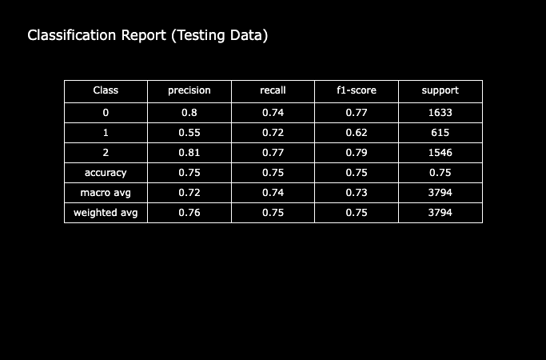

# Introduction
During the COVID-19 pandemic, Twitter became a key platform for people to express their emotions and opinions. Analyzing the sentiments of these tweets—whether positive 😊, negative 😠, or neutral 😐—provides valuable insights into public sentiment during this challenging time. This project aims to develop a machine learning model to predict the sentiment of COVID-19-related tweets.

Using a labeled dataset from Kaggle, we will first perform exploratory data analysis (EDA) 🔍 to understand the data's characteristics. Then, we will build and evaluate different models to accurately classify tweet sentiments. This analysis will help us better understand public reactions and contribute to the study of communication during global crises.

🔍 Check the full notebook file here: [Project Notebook](/project.ipynb)

🔍 Check the dataset from Kaggle here: [Dataset](https://www.kaggle.com/datasets/datatattle/covid-19-nlp-text-classification)

# Background
The COVID-19 pandemic, which began in early 2020, dramatically impacted daily life worldwide. During this time, people flocked to social media platforms like Twitter to express their thoughts, concerns, and experiences. Twitter, with its vast reach and real-time updates, became a key source for gauging public sentiment during the crisis.

Sentiment analysis, a key area of Natural Language Processing (NLP) 🧠, helps identify the emotional tone of text. In this project, we aim to build a machine learning model 🤖 to classify the sentiment of COVID-19-related tweets as positive, negative, or neutral. Using a labeled dataset from Kaggle 📊, we seek to understand public perception during the pandemic's critical early stages, providing insights into social reactions and emotional responses to global events.

# Exploratory Data Analysis
To begin with, the daily tweet count was examined, revealing a peak on March 20th with nearly 3,500 tweets. This surge coincides with California issuing a stay-at-home order, making it the first state in the United States to implement such a measure.


_Time Seires line grpah visualizing daily tweet count over time_

The analysis of sentiment percentages was conducted to understand social media trends during that period. The bar graph below shows that people generally leaned towards positivity, with 27.75% of tweets expressing a positive sentiment and 16.09% classified as extremely positive.


_Bar graph visualizing percentage of Tweet Sentiment_

The tweet counts for each country were analyzed to assess the level of social expression across different regions. The dataset recorded this information under the "location" field, and only locations with more than 100 tweets were considered. The results clearly show that the United States had the highest number of tweets compared to other countries.


_Bar grpah visualizing the count of tweet in each country_

# Data Preprocessing
The first step in preprocessing involves cleaning the text data. The following processes are required:
- Removing HTML tags
- Removing URLs
- Removing punctuation
- Removing stop words
- Removing non-English words
- Removing emojis
- Applying word stemming
  
The data was processed using the TF-IDF equation to convert text into columns, making it ready for model training.

```python
tfidf = TfidfVectorizer(smooth_idf=True)

X_train_tfidf = tfidf.fit_transform(X_train)
X_valid_tfidf = tfidf.transform(X_valid)
X_test_tfidf = tfidf.transform(X_test)
```
_Python code of utilizing TF-IDF_

Given the dataset's imbalance, with neutral sentiment being the least represented, oversampling is applied to increase the number of neutral tweets to match the counts of negative and positive tweets. This is achieved using SMOTE (Synthetic Minority Over-sampling Technique) to create synthetic data points for the minority class.
```python
smt = SMOTE()
X_train_sm, y_train_sm = smt.fit_resample(X_train_tfidf, y_train)
```
_Python code of utilizing SMOTE_

# Model Selection and Tuning
The following models were chosen for this project:
- Logistic Regression
- Multinomial Naive Bayes
- Random Forest Classifier
- XGBoost Classifier

Each model was trained and evaluated using various parameters to identify the optimal configuration based on the test data.

```python
models = {
    'LogisticRegression': LogisticRegression(),
    'MultinomialNB': MultinomialNB(),
    'RandomForest': RandomForestClassifier(random_state=42),
    'XGBoost': XGBClassifier(random_state=42)
}

param_grids = {
    'LogisticRegression': {},
    'MultinomialNB': {
        'alpha': [0.1, 0.5, 1.0, 1.5, 2.0]
    },
    'RandomForest': {
        'n_estimators': [100, 200, 500],
        'max_depth': [None, 10, 30],
        'min_samples_split': [2, 5, 10],
    },
    'XGBoost': {
        'n_estimators': [100, 200, 500],
        'learning_rate': [0.01, 0.1, 0.3],
        'max_depth': [3, 6, 10]
    }   
}

cv = KFold(n_splits=3, shuffle=True, random_state=42)
```
_Python code of model selection and tuning_

# Model Training
All models were trained using the GridSearchCV library, which evaluates them based on their roc-auc scores. The best-performing model was XGBoost, achieving an roc-auc score of 0.9239.
```Python
grids = {}
for model_name, model in models.items():
    print(f'Training and tuning {model_name}...')
    grids[model_name] = GridSearchCV(estimator=model, param_grid=param_grids[model_name], cv=cv,scoring='roc_auc_ovr_weighted', n_jobs=-1, verbose=1)
    grids[model_name].fit(X_train_sm, y_train_sm)
    
    y_train_pred = grids[model_name].predict(X_train_sm)
    
    best_params = grids[model_name].best_params_
    best_score = grids[model_name].best_score_

    acc = accuracy_score(y_train_sm, y_train_pred)
    f1 = f1_score(y_train_sm, y_train_pred, average='micro')
    
    print(f'Best Parameters for {model_name}: {best_params}')
    print(f'Best ROC AUC Score: {best_score}')
    print(f'Accuracy Score: {acc}')
    print(f'F1 Score: {f1}\n')
```
_Python code of model training_

```
Training and tuning LogisticRegression...
Fitting 3 folds for each of 1 candidates, totalling 3 fits
Best Parameters for LogisticRegression: {}
Best ROC AUC Score: 0.9192238814033881
Accuracy Score: 0.8496909078280197
F1 Score: 0.8496909078280197

Training and tuning MultinomialNB...
Fitting 3 folds for each of 5 candidates, totalling 15 fits
Best Parameters for MultinomialNB: {'alpha': 2.0}
Best ROC AUC Score: 0.8699482684875846
Accuracy Score: 0.7573568567525641
F1 Score: 0.7573568567525641

Training and tuning RandomForest...
Fitting 3 folds for each of 27 candidates, totalling 81 fits
Best Parameters for RandomForest: {'max_depth': None, 'min_samples_split': 2, 'n_estimators': 500}
Best ROC AUC Score: 0.920062490245169
Accuracy Score: 0.9991433400476951
F1 Score: 0.9991433400476951

Training and tuning XGBoost...
Fitting 3 folds for each of 27 candidates, totalling 81 fits
Best Parameters for XGBoost: {'learning_rate': 0.3, 'max_depth': 10, 'n_estimators': 500}
Best ROC AUC Score: 0.9239232776626974
Accuracy Score: 0.9606167951656596
F1 Score: 0.9606167951656596
```
_model training result_
# Model Evaluation
All models were assessed to identify the best performer on both the validation and test datasets. It was observed that the accuracy and F1-score of all models significantly decreased, which can be attributed to class imbalance in the validation and test datasets. Notably, logistic regression achieved the highest ROC-AUC score of 0.8959 and was the least impacted by overfitting. As a result, logistic regression was chosen as the top-performing model.

```python
for i in grids.keys():
    y_pred_proba = grids[i].predict_proba(X_valid_tfidf)
    y_pred = grids[i].predict(X_valid_tfidf)
    roc_auc = roc_auc_score(y_valid, y_pred_proba, average='weighted', multi_class='ovr')
    acc = accuracy_score(y_valid, y_pred)
    f1 = f1_score(y_valid, y_pred, average='micro')
    print (i)
    print(f'\nROC AUC Score: {roc_auc}')
    print(f'Accuracy Score: {acc}')
    print(f'F1 Score: {f1}\n')
    print(classification_report(y_valid, y_pred, target_names=['Negative', 'Neutral', 'Positive']))
    print(confusion_matrix(y_valid, y_pred))
    print("==========================================================")
    print()
```
_Python code of model evaluation on validation data_
```
LogisticRegression

ROC AUC Score: 0.8958800842121446
Accuracy Score: 0.7583099963472544
F1 Score: 0.7583099963472544

              precision    recall  f1-score   support

    Negative       0.79      0.74      0.76      3030
     Neutral       0.59      0.75      0.66      1543
    Positive       0.83      0.78      0.81      3640

    accuracy                           0.76      8213
   macro avg       0.74      0.76      0.74      8213
weighted avg       0.77      0.76      0.76      8213

[[2229  401  400]
 [ 214 1154  175]
 [ 389  406 2845]]
==========================================================

MultinomialNB

ROC AUC Score: 0.8499817603354125
Accuracy Score: 0.6979179349811275
F1 Score: 0.6979179349811275

              precision    recall  f1-score   support

    Negative       0.71      0.72      0.71      3030
     Neutral       0.57      0.53      0.55      1543
    Positive       0.74      0.75      0.75      3640

    accuracy                           0.70      8213
   macro avg       0.67      0.67      0.67      8213
weighted avg       0.70      0.70      0.70      8213

[[2167  281  582]
 [ 332  817  394]
 [ 560  332 2748]]
==========================================================

RandomForest

ROC AUC Score: 0.8695668632468097
Accuracy Score: 0.7248264945817606
F1 Score: 0.7248264945817606

              precision    recall  f1-score   support

    Negative       0.76      0.68      0.72      3030
     Neutral       0.57      0.71      0.64      1543
    Positive       0.78      0.77      0.77      3640

    accuracy                           0.72      8213
   macro avg       0.70      0.72      0.71      8213
weighted avg       0.73      0.72      0.73      8213

[[2056  408  566]
 [ 224 1099  220]
 [ 433  409 2798]]
==========================================================

XGBoost

ROC AUC Score: 0.8949896878830289
Accuracy Score: 0.7689029587239742
F1 Score: 0.7689029587239742

              precision    recall  f1-score   support

    Negative       0.79      0.74      0.76      3030
     Neutral       0.64      0.77      0.70      1543
    Positive       0.82      0.80      0.81      3640

    accuracy                           0.77      8213
   macro avg       0.75      0.77      0.76      8213
weighted avg       0.78      0.77      0.77      8213

[[2232  342  456]
 [ 196 1185  162]
 [ 410  332 2898]]
==========================================================
```
_Model evaluation on validation data result_

```python
for i in grids.keys():
    y_pred_proba = grids[i].predict_proba(X_test_tfidf)
    y_pred = grids[i].predict(X_test_tfidf)
    roc_auc = roc_auc_score(y_test, y_pred_proba, average='weighted', multi_class='ovr')
    acc = accuracy_score(y_test, y_pred)
    f1 = f1_score(y_test, y_pred, average='micro')
    print (i)
    print(f'\nROC AUC Score: {roc_auc}')
    print(f'Accuracy Score: {acc}')
    print(f'F1 Score: {f1}\n')
    print(classification_report(y_test, y_pred, target_names=['Negative', 'Neutral', 'Positive']))
    print(confusion_matrix(y_test, y_pred))
    print("==========================================================")
    print()
```
_Python code of model evaluation on test data_
```
LogisticRegression

ROC AUC Score: 0.887667228116487
Accuracy Score: 0.7482867685819715
F1 Score: 0.7482867685819715

              precision    recall  f1-score   support

    Negative       0.80      0.74      0.77      1633
     Neutral       0.55      0.72      0.62       615
    Positive       0.81      0.77      0.79      1546

    accuracy                           0.75      3794
   macro avg       0.72      0.74      0.73      3794
weighted avg       0.76      0.75      0.75      3794

[[1205  209  219]
 [ 108  440   67]
 [ 195  157 1194]]
==========================================================

MultinomialNB

ROC AUC Score: 0.842374974790024
Accuracy Score: 0.6987348444913021
F1 Score: 0.6987348444913021

              precision    recall  f1-score   support

    Negative       0.74      0.73      0.74      1633
     Neutral       0.52      0.49      0.51       615
    Positive       0.72      0.75      0.73      1546

    accuracy                           0.70      3794
   macro avg       0.66      0.66      0.66      3794
weighted avg       0.70      0.70      0.70      3794

[[1186  149  298]
 [ 155  303  157]
 [ 252  132 1162]]
==========================================================

RandomForest

ROC AUC Score: 0.8424630189080808
Accuracy Score: 0.6945176594623089
F1 Score: 0.6945176594623089

              precision    recall  f1-score   support

    Negative       0.75      0.67      0.71      1633
     Neutral       0.51      0.68      0.58       615
    Positive       0.74      0.73      0.73      1546

    accuracy                           0.69      3794
   macro avg       0.67      0.69      0.67      3794
weighted avg       0.71      0.69      0.70      3794

[[1096  234  303]
 [ 111  417   87]
 [ 255  169 1122]]
==========================================================

XGBoost

ROC AUC Score: 0.8817409470989199
Accuracy Score: 0.7509225092250923
F1 Score: 0.7509225092250923

              precision    recall  f1-score   support

    Negative       0.79      0.74      0.76      1633
     Neutral       0.59      0.71      0.65       615
    Positive       0.79      0.78      0.78      1546

    accuracy                           0.75      3794
   macro avg       0.72      0.74      0.73      3794
weighted avg       0.76      0.75      0.75      3794

[[1204  184  245]
 [ 100  439   76]
 [ 221  119 1206]]
==========================================================
```
_Model evaluation on test data result_


_Confusion Matrix of Logistic Regression model_


_Classification Report of Logistic Regression model_

# Conclusion
During the COVID-19 pandemic, sentiment analysis of tweets revealed crucial insights into public reactions and emotional responses. Using machine learning techniques, this project successfully classified tweet sentiments as positive, neutral, or negative. Exploratory Data Analysis (EDA) revealed trends such as a surge in tweets during key events like California’s stay-at-home order and the predominance of positive sentiments. Logistic Regression emerged as the most effective model, achieving a high ROC-AUC score of 0.8959 on the validation set. This study underscores the power of NLP in understanding communication during global crises, paving the way for further research in analyzing real-time societal responses.